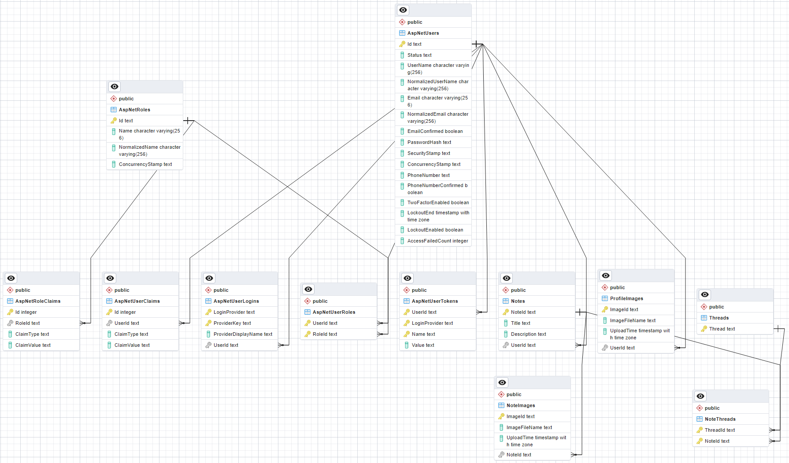

# Image-Sharing
Simple Web platform for image sharing. It was built using ASP.NET Core MVC.
## Features
* Registration
* Authentication & authorization
* User's dashboard that provides the ability to edit user data
* Users' profiles
* Image uploading
* Multiple images can be displayed inside one note (or post)
* The user is able to perform CRUD operations with his notes (create, change, delete)
* Notes can be assigned to a certain thread
* IP geolocation (kind of)
* Pagination of the notes and users
* Image galleries (with the use of [fancyBox](https://github.com/fancyapps/fancybox))
* Administrative panel (kind of)
* Localization (🇬🇧 & 🇷🇺)
* Unit-tests (using [xUnit](https://xunit.net/), [Fluent Assertions](https://fluentassertions.com/) & [FakeItEasy](https://fakeiteasy.github.io/))
* Containerization (using Docker Compose)
## Demonstation
### Overview:

### Entity relationship diagram:

