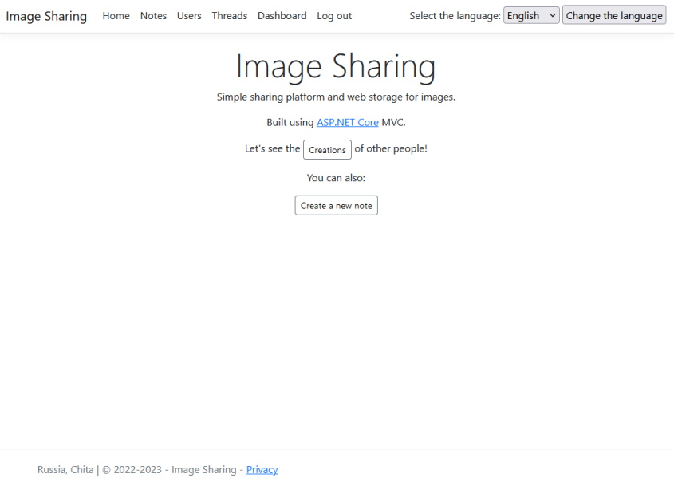
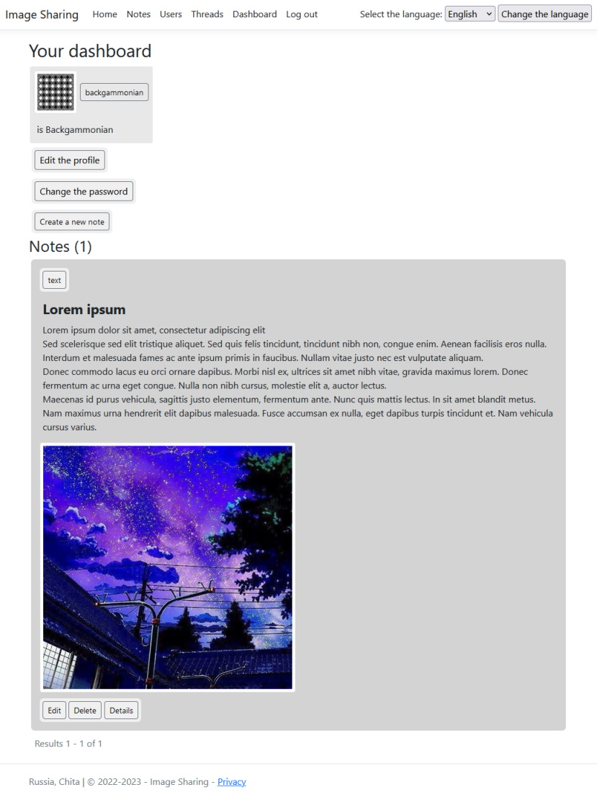
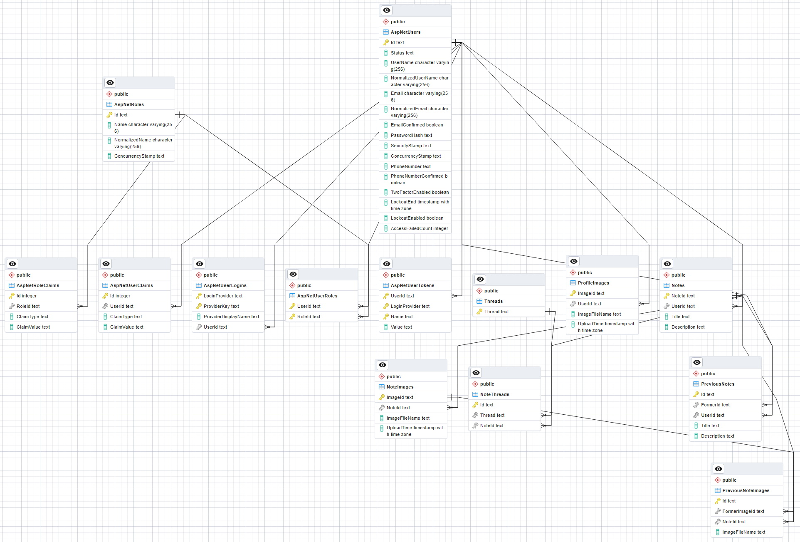

# Image-Sharing
Simple Web platform for image sharing. It was built using ASP.NET Core MVC.
## Features
* Registration
* Authentication & authorization
* User's dashboard (+ ability to edit user data)
* Users' profiles
* Image uploading
* Images exist inside the notes. User is able to manipulate his notes (create, change, delete)
* Notes can be assigned to a certain thread
* IP geolocation (kind of)
* Pagination of the notes
* Image galleries (using [fancyBox](https://github.com/fancyapps/fancybox))
* Administrative panel (kind of)
* Localization (🇺🇸 & 🇷🇺)
* Unit-tests (using [xUnit](https://xunit.net/), [Fluent Assertions](https://fluentassertions.com/) & [FakeItEasy](https://fakeiteasy.github.io/))
* Containerization (using Docker Compose)
## Demonstation

## Entity relationship diagram

